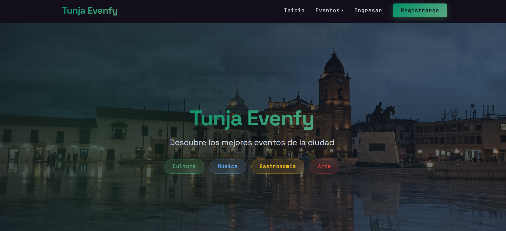
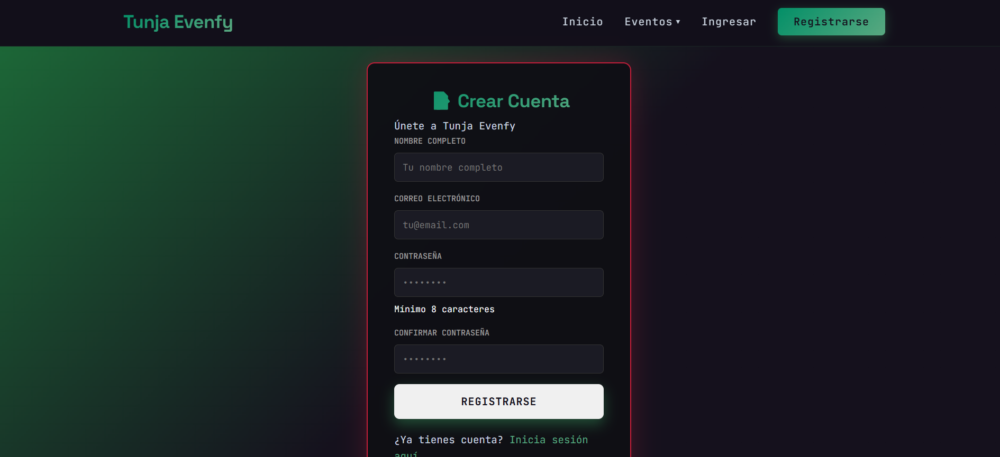
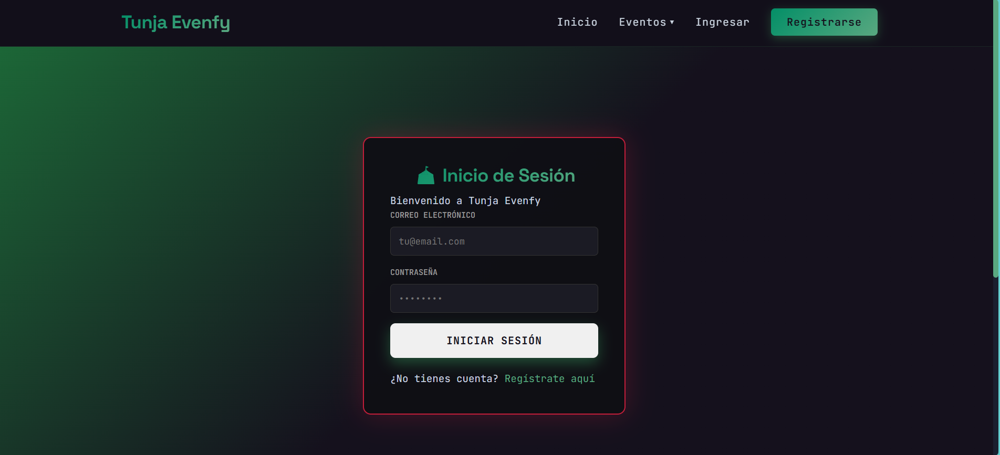
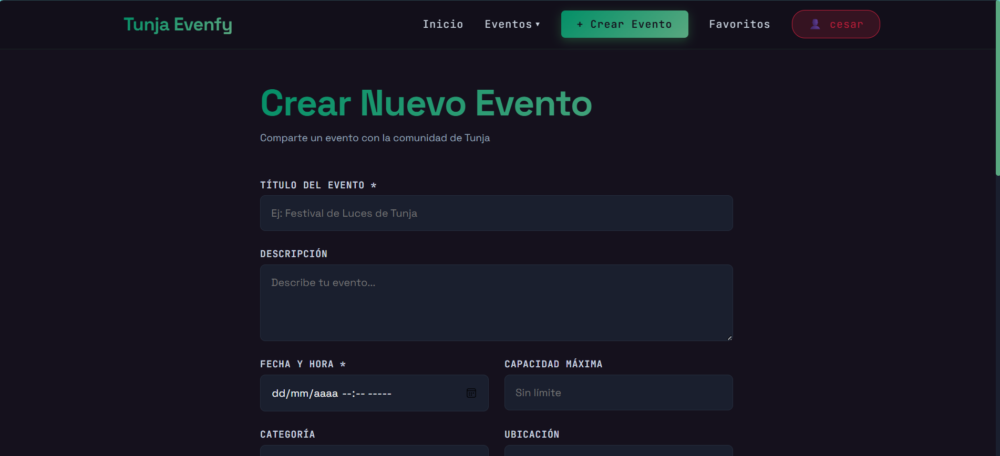
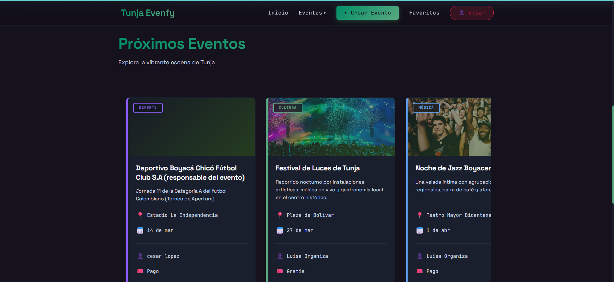

# Tunja Evenfy

Tunja Evenfy es una plataforma web para descubrir, publicar y administrar eventos en Tunja. El proyecto combina un backend REST en Spring Boot con un frontend en React para cubrir autenticación, consulta de eventos, panel de administración, favoritos, comentarios, asistencia y carga de imágenes.

## Qué resuelve el proyecto

- Consulta de eventos por categoría, título, ubicación y rango de fechas.
- Registro, inicio de sesión, verificación 2FA y control de acceso por roles.
- Gestión de eventos para administradores y organizadores.
- Participación social con comentarios, favoritos, ratings y asistencia.
- Carga de imágenes para eventos con publicación pública desde el backend.

## Stack técnico

| Capa | Tecnología |
|------|-----------|
| Backend | Spring Boot 3.5.7, Java 17 |
| Frontend | React 18, Vite 5, Axios, React Router |
| Base de datos | PostgreSQL 16 |
| Autenticación | Spring Security + JWT |
| Documentación | Springdoc OpenAPI / Swagger UI |
| Contenedores | Docker, Docker Compose |


## Estructura del proyecto

```text
.
├── src/main/java/org/jdc/tunja_evenfy/
│   ├── config/          # Seguridad, CORS, JWT, recursos estáticos
│   ├── dto/             # Contratos de entrada/salida
│   ├── entity/          # Entidades JPA
│   ├── exception/       # Excepciones y manejo global
│   ├── repository/      # Acceso a datos
│   ├── rest/            # Controladores REST
│   └── service/         # Lógica de negocio
├── src/main/resources/  # application.properties y perfiles
├── src/test/java/       # Pruebas del backend
├── frontend/src/
│   ├── components/      # Componentes reutilizables
│   ├── context/         # Estado global de autenticación
│   ├── pages/           # Pantallas principales
│   ├── services/        # Axios y consumo de API
│   ├── styles/          # Estilos globales
│   └── utils/           # Normalización y helpers
├── uploads/             # Archivos locales subidos en desarrollo
├── Dockerfile
├── docker-compose.yml
└── docker-compose.prod.yml
```


## Módulos principales

### Backend

- API REST bajo `/api/v1`.
- Persistencia con Spring Data JPA.
- Seguridad con JWT y autorización por roles `ADMIN`, `ORGANIZER` y `USER`.
- Exposición de archivos subidos mediante `/uploads/**`.
- Health checks y monitoreo básico con Actuator.

### Frontend

- Aplicación SPA en React con Vite.
- Cliente HTTP centralizado en `frontend/src/services/api.js`.
- Ruteo protegido con validación de autenticación y roles.
- Formularios para crear/editar eventos y consumo del endpoint de upload.

## Requisitos

- Java 17 o superior
- Node.js 18 o superior
- npm 9 o superior
- PostgreSQL 16 o superior


## ANEXOS DE LOS PROYECTO






---

## Variables y configuración

El backend usa `dev` por defecto y toma valores desde `application.properties` y `application-dev.properties`.

Variables importantes:

| Variable | Uso |
|----------|-----|
| `SPRING_PROFILES_ACTIVE` | Perfil activo (`dev` o `prod`) |
| `DB_URL` | URL JDBC de PostgreSQL |
| `DB_USERNAME` | Usuario de base de datos |
| `DB_PASSWORD` | Contraseña de base de datos |
| `JWT_SECRET` | Clave para firmar JWT |
| `JWT_EXPIRATION` | Expiración del token en ms |
| `CORS_ALLOWED_ORIGINS` | Orígenes permitidos |
| `MAIL_USERNAME` | Cuenta SMTP |
| `MAIL_PASSWORD` | Password SMTP |
| `RESEND_API_KEY` | Integración de correo alterna |
| `UPLOAD_DIR` | Carpeta física de archivos subidos |
| `VITE_API_URL` | Base URL del frontend para la API |

Configuración local por defecto del backend:

```properties
spring.datasource.url=jdbc:postgresql://localhost:5432/evenfy_db
spring.datasource.username=user_api
spring.datasource.password=1234
upload.dir=uploads
```

## Cómo correr el proyecto

## Backend local

1. Crear la base de datos en PostgreSQL:

```sql
CREATE DATABASE evenfy_db;
```

2. Verificar credenciales locales:

```text
DB_URL=jdbc:postgresql://localhost:5432/evenfy_db
DB_USERNAME=user_api
DB_PASSWORD=1234
```

3. Ejecutar el backend:

```powershell
.\mvnw.cmd spring-boot:run
```

URL esperada:

```text
http://localhost:8080
```

Notas:

- Si PostgreSQL no está corriendo, la API no va a levantar.
- En este workspace el backend compiló, pero no quedó disponible porque no había respuesta de PostgreSQL local ni Docker CLI para usar `docker compose`.

## Frontend local

1. Instalar dependencias:

```powershell
cd frontend
npm install
```

2. Ejecutar Vite:

```powershell
npm run dev
```

URL esperada:

```text
http://localhost:5173
```

Detalle importante:

- El frontend usa proxy Vite de `/api` hacia `http://localhost:8080` en desarrollo.
- Si quieres apuntar a otro backend, configura `VITE_API_URL`.

## Ejecución con Docker

Stack definido en `docker-compose.yml`:

- `postgres` en `5432`
- `backend` en `8080`
- `frontend` en `5173`

Comando:

```bash
docker compose up --build
```

Producción con imagenes publicadas:

```bash
docker compose -f docker-compose.prod.yml pull
docker compose -f docker-compose.prod.yml up -d
```

## Endpoints y accesos útiles

- Swagger UI: `http://localhost:8080/swagger-ui`
- Health check: `http://localhost:8080/actuator/health`
- API docs: `http://localhost:8080/v3/api-docs`

## Endpoints principales

| Recurso | Ruta base |
|---------|----------|
| Auth | `/api/v1/auth` |
| Usuarios | `/api/v1/users` |
| Eventos | `/api/v1/events` |
| Categorías | `/api/v1/categories` |
| Ubicaciones | `/api/v1/locations` |
| Comentarios | `/api/v1/comments` |
| Favoritos | `/api/v1/favorites` |
| Upload | `/api/v1/upload` |
| Asistencia | `/api/v1/events/{id}/attend` |
| Calificaciones | `/api/v1/events/{id}/rate` |


### Endpoint de carga

```text
POST /api/v1/upload/image
Content-Type: multipart/form-data
Campo esperado: file
```

Tipos permitidos:

- `image/jpeg`
- `image/png`
- `image/webp`
- `image/gif`

Tamaño máximo configurado:

- 5 MB por archivo

Respuesta esperada:

```json
{
	"url": "/uploads/archivo-generado.webp"
}
```

### Ruta pública del archivo

```text
GET /uploads/{nombre-del-archivo}
```

### Rutas que puedes acomodar luego

- Backend upload: `http://localhost:8080/api/v1/upload/image`
- Backend archivos públicos: `http://localhost:8080/uploads/{archivo}`
- Frontend en dev por proxy: `/api/v1/upload/image`
- Frontend con variable de entorno: `${VITE_API_URL}/v1/upload/image`

### Dónde se consume hoy en el frontend

- El cliente de upload está en `frontend/src/services/api.js` mediante `uploadService.uploadImage(file)`.
- La creación y edición de eventos consume la URL devuelta para guardar `image_url` del evento.
- Si cambias la ruta base, ajusta `VITE_API_URL` o el proxy de Vite según tu despliegue.

## CI/CD

El repositorio incluye:

- Workflow de integración continua en `.github/workflows/ci.yml`.
- Workflow de publicación de imágenes en `.github/workflows/cd-images.yml`.

Documentación adicional:

- `AUTHENTICATION_GUIDE.md`
- `DEPLOYMENT_GUIDE.md`
- `TESTING_GUIDE.md`
- `SECURITY_CHECKLIST.md`
